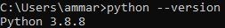
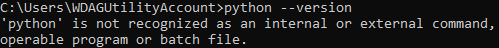
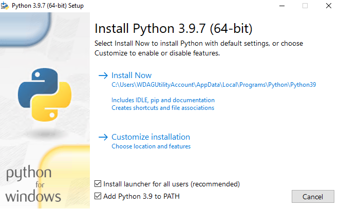
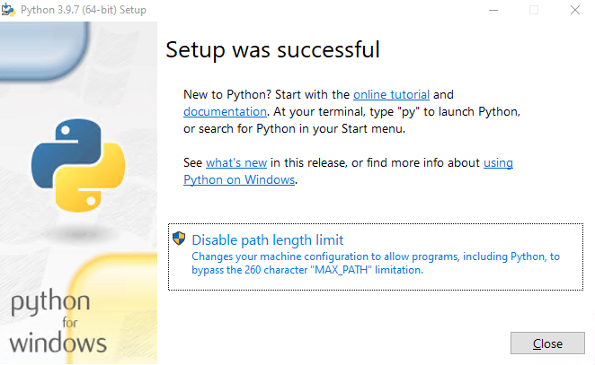

# RO Form Generator
Automates the creation of Borang RO for quarantined patients of Malaysia

### Table of Contents
* [Requirements](#requirements)
* [Setup](#setup)
  * [Windows](#windows)
  * [Linux](#linux)
  * [MacOS](#macos)
* [How to Use](#how-to-use)
  * [Excel Table Format](#excel-table-format)
  * [Set Proper Information](#set-proper-information)
  * [Required Files](#required-files)
  * [Running the Script](#running-the-script)
* [Credits](#credits)

### Requirements
* Internet connection (only during first setup)
* Python >= 3.6 (make sure to add `python` to `PATH`; Check out [Setup](#setup) section)
* `openpyxl~=3.0.7` module (check out [Setup](#setup) section)
* `docxtpl~=3.0.7` module (check out [Setup](#setup) section)

### Setup
This setup only covers Windows. Linux and MacOS setup steps will be added in future updates. Other OSes are not covered, but the setup is generally the same on other OSes.
##### Windows
1. Open command prompt, type `python --version`, and press `ENTER`. If your output is `Python <version>` and the version is >= 3.6, proceed to step 6.

2. Download Python from the [official website](https://www.python.org/downloads/).
3. Run the downloaded `exe` file, select `Add Python <version> to PATH`. If you do not have admin privileges (i.e. using laptops provided by the CAC), uncheck `Install launcher for all users (recommended)`. Then, proceed with the installation by clicking `Install Now`.

4. You may want to disable PATH limit for future use of `python`. Not needed if you are not using `python` for anything else. If you do not have admin privileges, skip this step.

5. Click `close`. Repeat step `1` again. You should see the output `Python <version>`. If it still says `'python' is not recognized as an internal or external command, operable program or batch file`, you may need to restart your computer.
6. If you have `git` installed, simply clone this repository to your computer by using the command `git clone https://github.com/FROST8ytes/Borang-RO-Generator.git`. Else, on the [GitHub](https://github.com/FROST8ytes/Borang-RO-Generator) page, click on `Code > Download ZIP`. Then, extract the ZIP archive.
7. Proceed to the unzipped folder/cloned repository, and copy the path to the folder/repo (i.e. `C:\Users\user\Downloads\Borang-RO-Generator`).
8. Open command prompt, type `cd <path to folder/repo>` (i.e. `cd https://github.com/FROST8ytes/Borang-RO-Generator`) and press `ENTER`.
9. Type `pip install -r requirements.txt` and press `ENTER`. This step will install all the required modules to run `generate_borang_ro.py`.

##### Linux
Will be written in future updates.

##### MacOS
Will be written in future updates.

### How to Use
This section covers the use and format requirements to use the script.
##### Excel Table Format
| A   | B    | C                         | D    | E          | F      | G          | H         |
|-----|------|---------------------------|------|------------|--------|------------|-----------|
| BIL | NAMA | NO KAD PENGENALAN/PASPORT | UMUR | NO TELEFON | ALAMAT | TARIKH HSO | TARIKH RO |
|     |      |                           |      |            |        |            |           |

Requirements:
* patient's name in column `B`
* patient's MyKad/Passport in column `C`
* patient's phone number in column `E`
* patient's address in column `F`
* patient's HSO date in column `G`
* patient's RO date in column 'H'

Future updates will include the flexibility of the column locations for patient's field.

##### Set Proper Information
1. Open `generate_borang_ro.py` with Notepad, VIM, or others.
2. Only change the `MODIFIABLE GLOBAL VARIABLES` section with proper info;
   1. `template_file_with_path`: the name of the docx template (borang RO)
   2. `excel_filename`: the name of the xlsx file to generate from
   3. `sheets_to_read`: list of sheets to read from in `excel_filename`
   4. `quarantine_days_required`: number of days required for patient to be quarantined before generating an RO form for them
   5. `doctors_name`: doctor's name (pegawai yang diberi kuasa)
   6. `doctors_position`: doctor's position (jawatan pegawai)
   7. `doctors_appointed_place`: CAC name
   8. `appointed_place_phone_number`: CAC's phone number
   9. `time`: time shown in the RO form before the signature field
   
##### Required Files
1. Make sure that the `template_file_with_path` file is in the same folder as `generate_borang_ro.py` file if the path is not explicitly written.
2. Make sure that the `excel_filename_with_path` file is in the same folder as `generate_borang_ro.py` file if the path is not explicitly written.

##### Running the Script
2 ways of running the program:
* command prompt: `python generate_borang_ro.py`
* double-click on the file `generate_borang_ro.py`
  * if you are on Linux/MacOS, make sure that the file is executable by running the command `chmod +x generate_borang_ro.py`.

The forms are generated into folders named based on which sheet they are from.

### Credits
Author: Ammar Farhan Mohamad Rizam